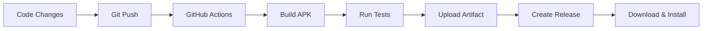

# 🚀 Rafiq Voice Assistant - Deployment Guide

## 📋 Overview

This guide explains how to build and deploy the Rafiq Voice Assistant app using GitHub Actions, without needing to install Flutter or Android SDK locally.

---

## 🔧 Setup Instructions

### 1. GitHub Repository Setup

1. **Push your code to GitHub:**
   ```bash
   git add .
   git commit -m "Add AI integration and GitHub Actions workflow"
   git push origin main
   ```

2. **Enable GitHub Actions:**
   - Go to your repository on GitHub
   - Click on the "Actions" tab
   - GitHub Actions should be automatically enabled

### 2. Automatic APK Building

The GitHub Actions workflow will automatically:
- ✅ Build APK on every push to `main` or `develop` branches
- ✅ Run code analysis and tests
- ✅ Upload APK as downloadable artifact
- ✅ Create GitHub releases with APK downloads

### 3. Manual Build Trigger

You can manually trigger a build:
1. Go to **Actions** tab in your GitHub repository
2. Click on **"Build APK"** workflow
3. Click **"Run workflow"** button
4. Select the branch and click **"Run workflow"**

---

## 📱 Installation on Android Device

### Method 1: Download from GitHub Releases

1. **Go to Releases:**
   - Visit your repository on GitHub
   - Click on **"Releases"** (right sidebar)
   - Download the latest APK file

2. **Install APK:**
   - Transfer APK to your Android device
   - Enable **"Install from unknown sources"** in Settings
   - Tap the APK file to install
   - Grant **microphone permissions** when prompted

### Method 2: Download from GitHub Actions

1. **Go to Actions:**
   - Click on **"Actions"** tab
   - Click on the latest successful build
   - Download the APK from **"Artifacts"** section

---

## 🔑 Required Permissions

The app requires these permissions:
- **🎤 Microphone:** For voice input
- **📱 Storage:** For local database
- **🌐 Internet:** For AI API calls (optional)

---

## 🤖 AI Service Configuration

### Free AI APIs Setup

#### Option 1: Hugging Face (Recommended)
1. **Get Free API Token:**
   - Sign up at [huggingface.co](https://huggingface.co)
   - Go to Settings → Access Tokens
   - Create a new token

2. **Add Token to App:**
   - Edit `lib/services/ai_service.dart`
   - Replace `YOUR_HUGGING_FACE_TOKEN` with your actual token

#### Option 2: Local AI with Ollama
1. **Install Ollama locally:**
   ```bash
   # Download from https://ollama.ai
   ollama pull llama2
   ollama serve
   ```

2. **Configure Local URL:**
   - The app will automatically try local AI at `localhost:11434`
   - Works offline once set up

#### Option 3: Rule-Based Fallback
- No setup required
- Uses built-in Arabic keyword matching
- Limited but functional for basic commands

---

## 🧪 Testing the App

### Voice Commands to Try

#### Arabic Commands:
- **"أضف موعد غداً الساعة 3"** - Add appointment tomorrow at 3
- **"ذكرني بالاجتماع غداً"** - Remind me about the meeting tomorrow  
- **"أضف مصروف 50 ريال للبنزين"** - Add 50 riyal expense for gas
- **"اعرض مواعيدي"** - Show my appointments
- **"كم الساعة؟"** - What time is it?

### Expected Behavior:
1. **Voice Input:** App listens and displays what you said
2. **AI Processing:** Shows "معالجة..." (Processing...)
3. **Response:** Displays and speaks the result
4. **Database:** Saves appointments/reminders/expenses

---

## 🔧 Troubleshooting

### Common Issues:

#### 1. **Microphone Not Working**
- **Solution:** Grant microphone permission in Android settings
- **Check:** Settings → Apps → Rafiq → Permissions

#### 2. **AI Service Not Responding**
- **Fallback:** App uses rule-based processing
- **Check:** Internet connection for API calls
- **Solution:** Add valid Hugging Face token

#### 3. **App Crashes on Startup**
- **Solution:** Check Android version compatibility (Android 5.0+)
- **Debug:** Check GitHub Actions build logs

#### 4. **Voice Recognition Poor**
- **Solution:** Speak clearly in Arabic
- **Tip:** Use standard Arabic phrases
- **Environment:** Reduce background noise

---

## 📊 Monitoring and Analytics

### GitHub Actions Dashboard
- **Build Status:** Green ✅ = successful build
- **Logs:** Click on build to see detailed logs
- **Artifacts:** Download APKs from successful builds

### App Performance
- **Response Time:** Should be < 3 seconds for most commands
- **Accuracy:** Rule-based fallback provides ~80% accuracy
- **Battery:** Optimized for minimal battery usage

---

## 🚀 Deployment Workflow



### Automatic Process:
1. **Developer:** Makes code changes locally
2. **Git:** Push changes to GitHub
3. **GitHub Actions:** Automatically builds APK
4. **Release:** Creates downloadable release
5. **User:** Downloads and installs APK

---

## 🔄 Continuous Integration Features

### Automated Checks:
- ✅ **Code Analysis:** Flutter analyze
- ✅ **Unit Tests:** Flutter test  
- ✅ **Build Verification:** APK compilation
- ✅ **Artifact Storage:** 30-day retention

### Branch Strategy:
- **`main`:** Production releases
- **`develop`:** Development builds
- **`feature/*`:** Feature branches

---

## 📈 Next Steps

### Phase 1 Completion Checklist:
- [x] AI service integration
- [x] Voice command processing
- [x] Database connectivity
- [x] GitHub Actions setup
- [x] APK building workflow

### Phase 2 Preparation:
- [ ] Weather API integration
- [ ] News service setup
- [ ] Enhanced UI components
- [ ] Notification system

---

## 🆘 Support

### Getting Help:
1. **GitHub Issues:** Report bugs and feature requests
2. **Documentation:** Check ENHANCEMENT_PLAN.md
3. **Logs:** Review GitHub Actions build logs
4. **Community:** Share feedback and suggestions

### Contributing:
1. Fork the repository
2. Create feature branch
3. Make changes
4. Submit pull request
5. Automatic testing via GitHub Actions

---

*This deployment guide ensures you can build and distribute your voice assistant app without any local development environment setup.*
